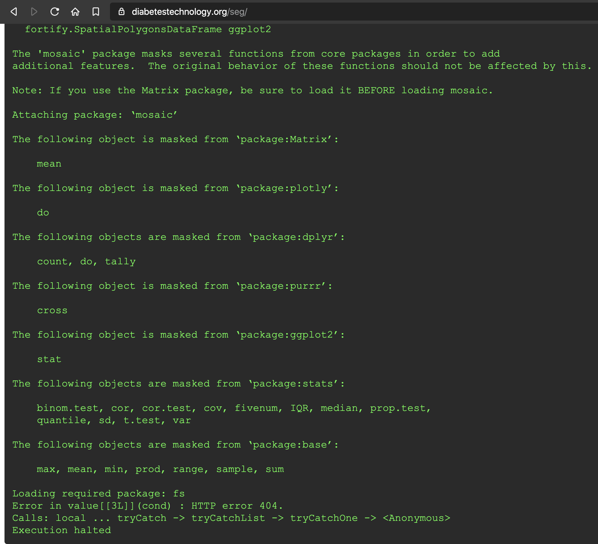

```{r setup, include=FALSE}
## Global options
# check dir
if (!file.exists("data/")) {
    fs::dir_create("data/")
}
# make raw data path
if (!file.exists("image/")) {
    fs::dir_create("image/")
}
## Global options
options(max.print = "90")
knitr::opts_chunk$set(
  echo = TRUE, # show/hide all code
  tidy = FALSE, # cleaner code printing
  comment = "#> ", # better console printing
  eval = TRUE, # turn this to FALSE stop code chunks from running
  message = TRUE, # show messages
  fig.width = 9, # figure width
  fig.height = 6, # figure height
  fig.path = "image/", # place images here
  warning = FALSE, # show warnings
  size = "small") # size of the text
knitr::opts_knit$set(width = 90)
library(dplyr) # Data wrangling, glimpse(50) and tbl_df().
library(ggplot2) # Visualise data.
library(lubridate) # Dates and time.
library(readr) # Efficient reading of CSV data.
library(stringr) # String operations.
library(tibble) # Convert row names into a column.
library(tidyr) # Prepare a tidy dataset, gather().
library(magrittr) # Pipes %>%, %T>% and equals(), extract().
library(tidyverse) # all tidyverse packages
library(mosaic) # favstats and other summary functions
library(fs) # file management functions
library(shiny) # apps
library(datapasta) # for pasting tibbles
library(styler) # cleaner code
```

# Welcome to the SEG Shiny app (version 0.3.3)

***This is not the code for the working app!***

This page outlines the code used to develop the SEG application. The working version is on the Diabetes Technology Society website [here](https://www.diabetestechnology.org/seg/).

The preview version (not necessarily stable) is available [here]().

For questions, issues, or feature requests, please email Martin at support@quesgen.com.

## Required packages 

```{r packages}
library(dplyr) # Data wrangling, glimpse(50) and tbl_df().
library(ggplot2) # Visualise data.
library(lubridate) # Dates and time.
library(readr) # Efficient reading of CSV data.
library(stringr) # String operations.
library(tibble) # Convert row names into a column.
library(tidyr) # Prepare a tidy dataset, gather().
library(magrittr) # Pipes %>%, %T>% and equals(), extract().
library(tidyverse) # all tidyverse packages
library(mosaic) # favstats and other summary functions
library(fs) # file management functions
library(shiny) # apps
library(datapasta) # for pasting tibbles
library(styler) # cleaner code
```

Document info:

* **Created date:** `r Sys.Date()`    

* **R version:** `r R.version.string`  

## Issues/bugs/fixes 

The app was throwing some errors on the DTS site 

```{r 2020-04-17-seg-error-dts, echo=FALSE}

```

This looks like a problem in the helpers file, but will investigate and confirm. 

There is also a problem with a SEG table summary, specifically, the `segTable()` function and it's interactions with DT.

```{r helpers.R, message=FALSE, warning=FALSE}
source("App/helpers.R")
segTable(dat = base::paste0(github_data_root, 
                            "VanderbiltComplete.csv")) %>% 
  # get data grouped/tallied by risk_cat
        dplyr::count(risk_cat, sort = TRUE) %>%
  # join to lkpSEGRiskCat4 table
        dplyr::full_join(x = .,
                         y = lkpSEGRiskCat4, 
                         by = "risk_cat") %>%
  # create new risk_cat
            dplyr::mutate(
            risk_cat = base::as.numeric(risk_cat),
            # and percent
            Percent = base::paste0(base::round(n / nrow(VandComp) * 100,
                                               digits = 1),
                                   if_else(condition = is.na(n),
                                          true = "", false = "%"))) %>%
  # sort the n column
          dplyr::arrange(desc(n)) %>%
  # rename everything prettier names
          dplyr::select(
                `SEG Risk Level` = risk_cat, # changed to level
                `SEG Risk Category` = risk_cat_txt,
                `Number of Pairs` = n,
                Percent) %>%
 # pass to color formatting
                DT::datatable(., options = list(lengthChange = FALSE,
                                         dom = 't',
                                         rownames = FALSE )) %>%
                # select numerical reference
                DT::formatStyle('SEG Risk Level',
                      target = "row",
                      backgroundColor = DT::styleEqual(
                          levels =  # eight levels/labels
                                c(0, 1, 2, 3,
                                    4, 5, 6, 7),
                            values = c("#00EE00", "#ADFF2F", "#FFFF00",
                                       "#FFD700", "#FFA500","#EE7600",
                                       "#FF4500", "#FF0000")))
```

This was fixed with a new column name for `SEG Risk Level`. 

## Error with SEG graph

The SEG tab was throwing this error:

`transformation for secondary axes must be a function`

And this was debugged below. In order to build the plot with the Gaussian smoothed background, a new image `seg_gaussian_layer_shiny` needed to be built in the `helpers.R` file

```{r move-seg_gaussian_layer_shiny-to-helpers.R}
# 1.0 - DEFINE heatmap inputs ============= 
# 1.0.1 read seg600.png with readPNG ----- -----
library(jpeg)
library(png)
# load the seg600.png file
download.file(url = "https://raw.githubusercontent.com/mjfrigaard/seg-shiny-data/master/Image/seg600.png", 
              destfile = "Image/seg600.png")
BackgroundSmooth <- png::readPNG("Image/seg600.png")
# 1.0.2 mmol conversion factor ---- -----
mmolConvFactor <- 18.01806
# 1.0.3 rgb2hex function ---- -----
# This is the RGB to Hex number function for R
rgb2hex <- function(r, g, b) rgb(r, g, b, maxColorValue = 255)
# 1.0.4 risk factor colors ----  -----
# These are the values for the colors in the heatmap.
abs_risk_0.0000_color <- rgb2hex(0, 165, 0)
# abs_risk_0.0000_color
abs_risk_0.4375_color <- rgb2hex(0, 255, 0)
# abs_risk_0.4375_color
abs_risk_1.0625_color <- rgb2hex(255, 255, 0)
# abs_risk_1.0625_color
abs_risk_2.7500_color <- rgb2hex(255, 0, 0)
# abs_risk_2.7500_color
abs_risk_4.0000_color <- rgb2hex(128, 0, 0)
# abs_risk_4.0000_color
riskfactor_colors <- c(
  abs_risk_0.0000_color,
  abs_risk_0.4375_color,
  abs_risk_1.0625_color,
  abs_risk_2.7500_color,
  abs_risk_4.0000_color
)
# 1.0.5 create base_data data frame ---- ----- 
base_data <- data.frame(
  x_coordinate = 0,
  y_coordinate = 0,
  color_gradient = c(0:4)
)
# These are the data objects used to define various components in the graph. 

# First create the base layer, but add the axes formats and adjust the point 
# to be almost non-existent. 
# - create base_layer plot ---- 
base_layer <- base_data %>% 
  ggplot(aes(
      x = x_coordinate,
      y = y_coordinate,
      fill = color_gradient)) +
  geom_point(size = 0.00000001,
             color = "white")
# scales_layer ------
scales_layer <- base_layer + 
  ggplot2::scale_y_continuous(
    limits = c(0, 600),
    sec.axis =
      sec_axis(~. / mmolConvFactor,
        name = "Measured blood glucose (mmol/L)"
      ),
    name = "Measured blood glucose (mg/dL)"
  ) +
  scale_x_continuous(
    limits = c(0, 600),
    sec.axis =
      sec_axis(~. / mmolConvFactor,
        name = "Reference blood glucose (mmol/L)"
      ),
    name = "Reference blood glucose (mg/dL)"
  )

# Now that the axes are set, I can add the smoothed image and create a 
# gaussian_layer
# the gaussian_layer ---- 
gaussian_layer <- scales_layer +
  ggplot2::annotation_custom(
    grid::rasterGrob(image = BackgroundSmooth, 
                               width = unit(1,"npc"), 
                               height = unit(1,"npc")), 
                               xmin = 0, 
                               xmax =  600, 
                               ymin = 0, 
                               ymax =  600) 


# In the next layer, I'll add the color gradient scaling and values, and also
# the custom labels for each level. 
# - the seg_gaussian_layer_shiny ---- 
seg_gaussian_layer_shiny <- gaussian_layer + 
    ggplot2::scale_fill_gradientn( # scale_*_gradientn creats a n-color gradient
    values = scales::rescale(c(
      0, # darkgreen
      0.4375, # green
      1.0625, # yellow
      2.75, # red
      4.0 # brown
    )), 
    limits = c(0, 4),
    colors = riskfactor_colors,
    guide = guide_colorbar(
      ticks = FALSE,
      barheight = unit(100, "mm")
    ),
    breaks = c(
      0.25,
      1,
      2,
      3,
      3.75
    ),
    labels = c(
      "none",
      "slight",
      "moderate",
      "high",
      "extreme"
    ),
    name = "risk level")
```

In the final layer, I'll add the sample data to the `seg_gaussian_layer_shiny` plot. 

```{r print-seg_gaussian_layer_shiny}
seg_gaussian_layer_shiny
```
Now we can test this with the `SampMeasData` file. 

```{r heatmap_plot}
SampMeasData <- VandComp %>% 
  dplyr::sample_frac(tbl = ., size = 0.10)
heatmap_plot <- seg_gaussian_layer_shiny +
  geom_point(
    data = SampMeasData, # introduce sample data frame
    aes(
      x = REF,
      y = BGM
    ),
    shape = 21,
    fill = "white",
    size = 1.1,
    stroke = 0.4,
    alpha = 0.8
  )
heatmap_plot
```

Just to make sure this works, I will remove this object and build the SEG plot like I would in the Shiny application.

```{r download-seg_gaussian_layer_shiny}
# remove seg_gaussian_layer_shiny
rm(seg_gaussian_layer_shiny)
# import rds file
seg_gaussian_layer_shiny <- readr::read_rds("App/seg_gaussian_layer_shiny.rds")
```

```{r check-seg_gaussian_layer_shiny}
seg_gaussian_layer_shiny
```

Now I add the sample data to the gaussian layer.

```{r add-sample-data-to-seg_gaussian_layer_shiny}
# 6.6 - introduce sample data frame -----
heat_map_2.0 <- seg_gaussian_layer_shiny + 
  geom_point(
    data = SampMeasData, 
    aes(
      x = REF,
      y = BGM
    ),
    shape = 21,
    fill = "white",
    size = 1.1,
    stroke = 0.4,
    alpha = 0.8
  )

# final plot -------
heat_map_2.0
```

Remove `seg600.png`

```{r remove-seg600.png}
unlink("seg600.png")
```


