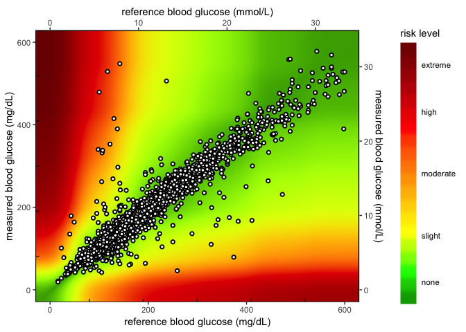

```{r setup, include=FALSE}
## Global options
# check dir
if (!file.exists("data/")) {
    fs::dir_create("data/")
}
# make raw data path
if (!file.exists("image/")) {
    fs::dir_create("image/")
}
## Global options
options(max.print = "90")
knitr::opts_chunk$set(
  echo = TRUE, # show/hide all code
  tidy = FALSE, # cleaner code printing
  comment = "#> ", # better console printing
  eval = TRUE, # turn this to FALSE stop code chunks from running
  message = TRUE, # show messages
  fig.width = 9, # figure width
  fig.height = 6, # figure height
  fig.path = "image/", # place images here
  warning = FALSE, # show warnings
  size = "small") # size of the text
knitr::opts_knit$set(width = 90)
library(dplyr) # Data wrangling, glimpse(50) and tbl_df().
library(ggplot2) # Visualise data.
library(lubridate) # Dates and time.
library(readr) # Efficient reading of CSV data.
library(stringr) # String operations.
library(tibble) # Convert row names into a column.
library(tidyr) # Prepare a tidy dataset, gather().
library(magrittr) # Pipes %>%, %T>% and equals(), extract().
library(tidyverse) # all tidyverse packages
library(mosaic) # favstats and other summary functions
library(fs) # file management functions
library(shiny) # apps
library(datapasta) # for pasting tibbles
library(styler) # cleaner code
```


# Welcome to the SEG Shiny app (version 0.3.3)

***This is not the code for the working app!***

This page outlines the code used to develop the SEG application. The working version is on the Diabetes Technology Society website [here](https://www.diabetestechnology.org/seg/).

The preview version (not necessarily stable) is available [here]().

For questions, issues, or feature requests, please email Martin at support@quesgen.com.

## Required packages 

```{r packages}
library(dplyr) # Data wrangling, glimpse(50) and tbl_df().
library(ggplot2) # Visualise data.
library(lubridate) # Dates and time.
library(readr) # Efficient reading of CSV data.
library(stringr) # String operations.
library(tibble) # Convert row names into a column.
library(tidyr) # Prepare a tidy dataset, gather().
library(magrittr) # Pipes %>%, %T>% and equals(), extract().
library(tidyverse) # all tidyverse packages
library(mosaic) # favstats and other summary functions
library(fs) # file management functions
library(shiny) # apps
library(datapasta) # for pasting tibbles
library(styler) # cleaner code
```

Document info:

* **Created date:** `r Sys.Date()`    

* **R version:** `r R.version.string`  


**The `App` folder**

- The `App` folder has the application script files and data. The file `app.R` is the actual application, while `helpers.R` has additional necessary functions for wrangling, etc.

```{r App-tree, echo=FALSE}
fs::dir_tree("App")
```


**The `Code` folder**

- This folder contains previous versions, functions, and individual application elements. 

```{r Code-tree, echo=FALSE}
fs::dir_tree("Code")
```

**The `Data` folder**

- This contains the data for the application. Most of these data files are downloaded from the `SEG_shiny` repository [here](https://github.com/mjfrigaard/SEG_shiny/). This was changed in version 1.3.2 to [this repository](https://github.com/mjfrigaard/seg-shiny-data) because the name is more accurate. 


```{r Data-tree, echo=FALSE}
fs::dir_tree("Data")
```

**The `Image` folder**

- These are the images for the `README.Rmd`, the application, and other example outputs. 

```{r Image-tree, echo=FALSE}
fs::dir_tree("Image")
```


***

# The Application outline

These are all in the `App/app.R` file. The SEG shiny application contains a sidebar panel and the following four tabs:  `Instructions`, `Summary Tables`, `SEG`, and `Modified Bland-Altman Plot`.

## The sidebar panel

The portion of code that defines the sidebar is numbered from `0.0` -  `0.2.6`.

```{r sidebar-panel, eval=FALSE}

  # 0.1 ## ## ## ## ## START sidebarPanel( ----

  sidebarPanel(

    # 0.1.0 <TITLE TEXT> -----
    em("Welcome to the surveillance error graph!"),

    br(),

    # Horizontal line
    tags$hr(),

    # 0.1.1 - <SIDEPANEL> Download: sample file [downloadSampleData] ----

    h4("Download a sample CSV file:"),

    downloadButton(
      outputId = "downloadSampleData",
      label = "Download a sample CSV file"
    ),

    br(),
    # Horizontal line
    tags$hr(),

    # 0.1.2 - <SIDEPANEL> Upload: upload file [$file1] ----
# ** ** ** This is where we define the input for the .csv file!!! ** ** ** ----
    h4("Import your own CSV file:"),

    fileInput(
   # ~~~~ CSV file inputId ~~~~ ~~~~ ----
      inputId = "file1",
      label = "Choose File to Upload:",
      accept = c(
        "text/csv",
        "text/comma-separated-values,text/plain",
        ".csv"
      )
    ),

    # 0.1.3 - <SIDEPANEL> Select number of rows to display [disp] ----

    h4("Select number of rows to display in your .csv file:"),


    radioButtons(inputId = "disp", label = "Display",
                 choiceNames = list("Top 10", "Top 20"),
                 choiceValues = list("Top 10", "Top 20")
                 ),

    # 0.1.4 - <SIDEPANEL> Table Output: display data file [contents] ----

    tableOutput(outputId = "contents"),

    # Horizontal line
    tags$hr(),

    # 0.1.5  - <SIDEPANEL> Title for summary tables  -----

    h4("Create Summary Tables:"),

    # 0.1.6 - <SIDEPANEL> [Button = SEGSummaryTableButton] for summary -------

    actionButton(
      inputId = "SEGSummaryTableButton",
      label = "Create Summary Tables"
    ),

    # Horizontal line
    tags$hr(),

    # 0.1.7 - <SIDEPANEL> [Button 2 = $CreateSEGTables] for SEG tables button  -----
    h4("Create SEG Tables:"),

    actionButton(
      inputId = "CreateSEGTables",
      label = "Create SEG Tables"
    ),

    # Horizontal line
    tags$hr(),

    # 0.1.8 - <SIDEPANEL> CUSTOMIZE SEG (h4) ----
    h4("Customize your SEG:"),

    # 0.1.9  - <SIDEPANEL> INPUTS for [alpha] ----
    sliderInput(
      inputId = "alpha",
      label = "Alpha (opacity) of points:",
      min = 0,
      max = 1,
      value = 0.5
    ),

    # 0.2.0  - <SIDEPANEL> INPUTS for point [color] ----
    colourInput(
      inputId = "color",
      label = "Point color",
      value = "white"
    ),

    # 0.2.1  - <SIDEPANEL> INPUTS for point [size] ----
    numericInput(
      inputId = "size",
      label = "Point size",
      value = 2,
      min = 1
    ),

    # 0.2.2  -<SIDEPANEL> INPUTS text for plot title [plot_title] -----
    textInput(
      inputId = "plot_title",
      label = "Plot title",
      placeholder = "Enter text to be used as plot title"
    ),

    # 0.2.3  - <SIDEPANEL> INPUTS SEG plot file download [heatmap_file] -----
    radioButtons(
      inputId = "heatmap_file",
      label = "Select the file type for your SEG",
      choices = list("png", "pdf")
    ),

    br(),
    # download id
    downloadButton(
      outputId = "heatmap_file_download",
      label = "Download SEG"
    ),

    # 0.2.4 - <SIDEPANEL> INPUTS MOD BA plot file download -----
    radioButtons(
      inputId = "modba_plot_file",
      label = "Select the file type for your Bland Altman Plot",
      choices = list("png", "pdf")
    ),

    br(),

    # download id
    downloadButton(
      outputId = "modba_plot_download",
      label = "Download Mod-BA plot"
    ),

    # add some space
    br(),
    # Horizontal line
    tags$hr(),

    # 0.2.5 -<SIDEPANEL> Shiny and RStudio logo -----
    # these have been moved to the Github repo in the www folder 
    h5(
      "Built by",
      # Quesgen logo
      img(
        src = "QuesGenLogo.png",
        height = "25%",
        width = "25%"
      ),
      "using",
      # Shiny logo
      img(
        src = "shiny.png",
        height = "25%",
        width = "25%"
      ),
      "by",
      # RStudio Logo
      img(
        src = "RStudio-Logo-Blue-Gray.png",
        height = "25%",
        width = "25%"
      )
),
    # 0.2.6 -<SIDEPANEL> support email -----
h6("Questions? Email support@quesgen.com")

  ), # end sidebarPanel ) <- Do not forget a comma here! ----
```


## The Instructions tab

The `Instructions` tab presents instructions for uploading a data set and an example data set for downloading.

> Upload your data in a comma separated values (CSV) file by clicking on the 'Browse' button in the left sidebar panel. Please refer to the image below. Your CSV file should contain only two columns. The blood glucose monitor (BGM) readings should be in the leftmost column under the heading 'BGM'. These are the meter readings or point-of-care readings. The reference values should be in the next column under the label 'REF'. Reference values might come from simultaneously obtained plasma specimens run on a laboratory analyzer such as the YSI Life Sciences 2300 Stat Plus Glucose Lactate Analyzer. If you have any questions about how your CSV data file should look before uploading it, please download the sample data set we have provided.

The previous image for saving as .csv has been replaced with the image below. 

```{r new-save-as-png}
# fs::dir_ls("image")

```


> After you have uploaded your .csv file, click on the Create Summary Tables and the Create SEG Tables button in the left-hand panel. The results can be viewed on the 'Summary Tables' tab and 'SEG' tab.
> When your .csv file finishes uploading, a static graph will be generated from the BGM and REF values. You may customize your static graph parameters in the left sidebar panel and download the graph to your computer (as either a .png or .pdf). See the example provided below:

This was changed because now we have a new image for the heatmap plot. See the code changes below

```{r heat_map_2.0}
# fs::dir_ls("image")

```

I'll upload the .csv data from Vanderbilt. I have all the data in a Github repo, so I can load all the Vanderbilt data below after defining the path to the `Data/` folder. 

```{r github-data-image-roots}
github_data_root <- "https://raw.githubusercontent.com/mjfrigaard/seg-shiny-data/master/Data/"
github_image_root <- "https://raw.githubusercontent.com/mjfrigaard/seg-shiny-data/master/Image/"
```


```{r upload-vanderbilt-csv}
VandComp <- readr::read_csv(base::paste0(github_data_root, "VanderbiltComplete.csv"))
VandComp %>% glimpse(78)
```

These data can be used as an example to re-create the tables. 

## Instructions tab code

The code for the instructions tab is below. This code starts on lines 225 in the `App.R` file. 

### Instructions in the UI

The `UI` portion of the `Instructions` tab is below. Most of this is text and images.

```{r instructions-tab, eval=FALSE}

      tabPanel(
        # 2.1.0 < INSTRUCTIONS PANEL (Title)> ----
        title = "Instructions",

        # 2.1.1 text1 ** **  ** ** ** < UPLOAD .CSV FILE TEXT > text1 ----
        
        h5(textOutput(outputId = "text1")),
        
        #  "Upload your data in a comma separated values (CSV) file by clicking 
        #  on the 'Browse' button in the left sidebar panel. Please refer to 
        #  the image below. Your CSV file should contain only two columns. The 
        #  blood glucose monitor (BGM) readings should be in the leftmost column
        #  under the heading 'BGM'. These are the meter readings or 
        #  point-of-care readings. The reference values should be in the next 
        #  column under the label 'REF'. Reference values might come from 
        #  simultaneously obtained plasma specimens run on a laboratory 
        #  analyzer such as the YSI Life Sciences 2300 Stat Plus Glucose 
        #  Lactate Analyzer. If you have any questions about how your CSV data
        #  file should look before uploading it, please download the sample 
        #  data set we have provided."

        # 2.1.2 < INSTRUCTIONS PANEL > (save_as_csv.png IMAGE) ----
            # add some space
            br(),
            # Horizontal line
            tags$hr(),

        img(
          src = "save_as_csv.png",
          width = "80%",
          height = "80%"
        ),

        # 2.1.3 < INSTRUCTIONS PANEL > Text .csv/click buttons (text2) ----

        # 2.1.3 text2 ** **  ** ** ** < SUMMARY TABLE TEXT > text2 ----
        h5(textOutput(outputId = "text2")),
        
        # "After you have uploaded your .csv file, click on the Create 
        # Summary Tables and the Create SEG Tables button in the left-hand
        # panel. The results can be viewed on the 'Summary Tables' tab and
        # 'SEG' tab."
```

This is the new image for the application. The changes are the image file `heat_map_2.0.png`, the `width = "95%"`, and the `height = "95%"`.

```{r new-example-seg-graph, eval=FALSE}
        
        # # 2.1.4 < INSTRUCTIONS PANEL > SEG Text Tab (text3) ----

        # 2.1.4 text3 ** **  ** ** ** < GRAPH TEXT > text3 ----
        h5(textOutput(outputId = "text3")),
        
        # "When your .csv file finishes uploading, a static graph will be 
        # generated from the BGM and REF values. You may customize your 
        # static graph parameters in the left sidebar panel and download the
        # graph to your computer (as either a .png or .pdf). See the example 
        # provided below:"

        img(
          src = "heat_map_2.0.png",
          width = "95%",
          height = "95%"
        )
      ),
```


### Instructions in the SERVER

These items are displayed using the server below. 

```{r instructions-server, eval=FALSE}
  # 2.1 - INSTRUCTIONS PANEL <text output> -----

  # 2.1.1 text1 ** **  ** ** ** RENDER text1 -----
  
  output$text1 <- renderText({
    "Upload your data in a comma separated values (CSV) file by clicking on the 'Browse' button in the left sidebar panel. Please refer to the image below. Your CSV file should contain only two columns. The blood glucose monitor (BGM) readings should be in the leftmost column under the heading 'BGM'. These are the meter readings or point-of-care readings. The reference values should be in the next column under the label 'REF'. Reference values might come from simultaneously obtained plasma specimens run on a laboratory analyzer such as the YSI Life Sciences 2300 Stat Plus Glucose Lactate Analyzer. If you have any questions about how your CSV data file should look before uploading it, please download the sample data set we have provided."
  })

  # 2.1.3 text2 ** **  ** ** ** RENDER text2 -----
    output$text2 <- renderText({
    "After you have uploaded your .csv file, click on the Create Summary Tables and the Create SEG Tables button in the left-hand panel. The results can be viewed on the 'Summary Tables' tab and 'SEG' tab."
  })

  
  # 2.1.4 text3 ** **  ** ** ** RENDER text3 -----
  output$text3 <- renderText({
    "When your .csv file finishes uploading, a static graph will be generated from the BGM and REF values. You may customize your static graph parameters in the left sidebar panel and download the graph to your computer (as either a .png or .pdf). See the example provided below:"
  })
```


This is the landing page for the application. 

## The Summary Tables tab

The summary tables are all calculated on tab 2. These tables have a variety of text sections that describes the calculation and the interpretation. 

These require a variety of data inputs I load here from Github.

```{r load-data-inputs, results='hide'}
RiskPairData <- readr::read_csv(paste0(github_data_root, 
                                                    "AppRiskPairData.csv"))
LookUpRiskCat <- readr::read_csv(paste0(github_data_root, 
                                                        "AppLookUpRiskCat.csv"))
lkpRiskGrade <- readr::read_csv(base::paste0(github_data_root,
                                                            "lkpRiskGrade.csv"))

lkpSEGRiskCat4 <- readr::read_csv(base::paste0(github_data_root,
                                                            "lkpSEGRiskCat4.csv"))

```

### The PairTypeTable1 table in the UI

There are four different text inputs for the `PairTypeTable1` in the first portion of the `Summary Tables` tab. 

The text for this section is below:

> The Surveillance Error Grid Analysis Tool Output:  
> BGM = Blood Glucose Monitor  
> REF = Reference  

> This contains the number of BGM values that were 1) less than the REF values, 2) equal to the REF values, and 3) greater than the REF values. Note that REF values >600 mg/dL will not be plotted on the SEG. This tab also stratifies the values across eight clinical risk levels.

```{r summary-tables-PairTypeTable1-ui, eval=FALSE}
# # 2.2 PANEL 2 < SUMMARY TABLES > ----

      tabPanel(
        title = "Summary Tables",

        # ~~~~~~~~~~~~~~~~~~~~~~~~~~~~~~~~~~~~~~~~~~~~~~~~~~~~~~~~~~~~~~~~~~~~~~
        # 2.2.1 < SUMMARY PairTypeTable1 > Tab 2 Text (text4.1-4.4) ----
        # ~~~~~~~~~~~~~~~~~~~~~~~~~~~~~~~~~~~~~~~~~~~~~~~~~~~~~~~~~~~~~~~~~~~~~~
        
        # 2.2.1.1 text4.1 ** **  ** ** ** < PairTypeTable1 > text4.1 ----
        h4(textOutput(outputId = "text4.1")),
        #     "The Surveillance Error Grid Analysis Tool Output:"

        # 2.2.1.2 text4.2 ** **  ** ** ** < PairTypeTable1 > text4.2 ----
        h5(textOutput(outputId = "text4.2")),
        #      "BGM = Blood Glucose Monitor"

        # 2.2.1.3 text4.3 ** **  ** ** ** < PairTypeTable1 > text4.3 ----
        h5(textOutput(outputId = "text4.3")),
        #       "REF = Reference"

        # 2.2.1.4 text4.4 ** **  ** ** ** < PairTypeTable1 > text4.4 ----
        h5(textOutput(outputId = "text4.4")),

        # "This contains the number of BGM values that were 1) less than the REF
        # values, 2) equal to the REF values, and 3) greater than the REF 
        # values. Note that REF values < 21 mg/dL or >600 mg/dL will not be 
        # plotted on the SEG. This tab also stratifies the values across eight
        # clinical risk levels."

            # add some space
            br(),
            # Horizontal line
            tags$hr(),

        # ~~~~~~~~~~~~~~~~~~~~~~~~~~~~~~~~~~~~~~~~~~~~~~~~~~~~~~~~~~~~~~~~~~~~~~
        # 2.2.2 < SUMMARY TABLES > define PairTypeTable1 table outputId ----
        # ~~~~~~~~~~~~~~~~~~~~~~~~~~~~~~~~~~~~~~~~~~~~~~~~~~~~~~~~~~~~~~~~~~~~~~
            # add some space
            br(),
        tableOutput(outputId = "PairTypeTable1"),
            # add some space
            br(),
```

## The PairTypeTable1 table in the SERVER

This is the portion of the data  

```{r summary-tables-PairTypeTable1-server, eval=FALSE}
# 2.2.2 <SUMMARY TAB> RENDER PairTypeTable1 TABLE ---- ---- ---- ----
  # this presents the output from the reactive above

  output$PairTypeTable1 <- renderTable({

    input$SEGSummaryTableButton

    # req(datasetSEG()) # ensure availablity of value before proceeding
    # isolate thre presentation of this table
    isolate({
      PairType()
      })
    },
      striped = TRUE,
      hover = TRUE,
      spacing = "m",
      align = "l",
      digits = 1)

```


This table lists the pair types for each `REF` and `BGM` value pair. The previous version is below: 

```{r PairType1.3}
PairType1.3 <- tibble::tribble(
                                    ~Pair.Type, ~Count,
           "REF <21: Included in SEG Analysis",     3L,
       "REF > 600: Excluded from SEG Analysis",    23L,
                                       "Total",  9891L,
                                   "BGM < REF",  4710L,
                                   "BGM = REF",   479L,
                                   "BGM > REF",  4702L,
              "Total included in SEG Analysis",  9868L)
PairType1.3
```

The new version needs to list these values in the following order:

```
Total
BGM < REF
BGM = REF
BGM > REF
REF > 600 : Excluded from SEG Analysis
Total Included in SEG Analysis
```

With the `VanderbiltComplete.csv` data, this table will have the following order/counts.

```{r PairType1.3.2}
PairType1.3.2 <- tibble::tribble(
                                  ~`Pair Type`, ~Count,
                                       "Total",  9891L,
                                   "BGM < REF",  4710L,
                                   "BGM = REF",   479L,
                                   "BGM > REF",  4702L,
       "REF > 600: Excluded from SEG Analysis",    23L,
              "Total included in SEG Analysis",  9868L)
PairType1.3.2
```

This table is created with the `pairtypeTable()` function. 

### The pairtypeTable() function version 1.3.2

I've made a few revisions to this function so the rows/counts come out in the requested order.  

```{r pairtypeTable1.3.2}
# 2.1 pairtypeTable() FUNCTION  ---- ----  ---- ----  ---- ----  ---- ----
pairtypeTable <- function(dat) {
  # 2.1.1 - import data frame/define SampMeasData ----
  SampMeasData <- readr::read_csv(dat)
  # 2.1.2 - convert the columns to numeric  ----
  SampMeasData <- SampMeasData %>%
    dplyr::mutate(BGM = as.double(BGM),
                  REF = as.double(REF)) %>%
  # 2.2 create bgm_pair_cat ---- ----  ----
    dplyr::mutate(
      bgm_pair_cat =
        dplyr::case_when(
          BGM < REF ~ "BGM < REF",
          BGM == REF ~ "BGM = REF",
          BGM > REF ~ "BGM > REF"
        )
    ) %>%
    # 2.3 create excluded ---- ----  ----
    dplyr::mutate(
      excluded =
        dplyr::case_when(
          REF > 600 ~ "REF > 600: Excluded from SEG Analysis",
          TRUE ~ NA_character_
        )
    ) %>%
    # 2.4 create included ---- ----  ----
    dplyr::mutate(
      included =
        dplyr::case_when(
          REF <= 600 ~ "Total included in SEG Analysis",
          REF > 600 ~ "Total excluded in SEG Analysis"
        )
    )
  # 2.5 create BGMPairs ---- ---- ----
  BGMPairs <- SampMeasData %>%
    dplyr::count(bgm_pair_cat) %>%
    dplyr::rename(
      `Pair Type` = bgm_pair_cat,
      Count = n
    )
  # 2.6 create Excluded ---- ---- ----
  Excluded <- SampMeasData %>%
    dplyr::count(excluded) %>%
    dplyr::rename(
      `Pair Type` = excluded,
      Count = n
    ) %>%
    dplyr::filter(!is.na(`Pair Type`))
  # 2.7 create Included ---- ---- ----
  Included <- SampMeasData %>%
    dplyr::count(included) %>%
    dplyr::rename(
      `Pair Type` = included,
      Count = n
    ) %>%
    dplyr::filter(`Pair Type` == "Total included in SEG Analysis")
  # 2.8 create PairTypeTable ----  ----  ----
  PairTypeTable <- dplyr::bind_rows(BGMPairs, 
                                    Excluded, 
                                    Included)
  # 2.9 add the Total row  ----  ----  ----
  PairTypeTable <- PairTypeTable %>% tibble::add_row(
    `Pair Type` = "Total",
    Count = nrow(SampMeasData),
    .after = 0
  )
  return(PairTypeTable)
}
```

If I pass `VandComp` data to this function, I should get the adjusted row order back. 

```{r test-pairtypeTable-VandCamp}
pairtypeTable(dat = paste0(github_data_root, "VanderbiltComplete.csv"))
```

I will also test it with the dataset of 188 points. 

```{r test-pairtypeTable-No_Interference_Dogs.csv}
pairtypeTable(dat = paste0(github_data_root, "No_Interference_Dogs.csv"))
```

This works. Adding to the `helpers.R` file.

### The MARDTable2 table in the UI

This is the `MARDTable2` portion in the `UI`. It is preceded by a few text inputs that describe the acronyms and calculations.

```{r summary-tables-MARDTable2-ui, eval=FALSE}
        # ~~~~~~~~~~~~~~~~~~~~~~~~~~~~~~~~~~~~~~~~~~~~~~~~~~~~~~~~~~~~~~~~~~~~~~
        # 2.2.3 < SUMMARY MARD text > Tab 2 Text (text6.1 - text6.5) ----
        # ~~~~~~~~~~~~~~~~~~~~~~~~~~~~~~~~~~~~~~~~~~~~~~~~~~~~~~~~~~~~~~~~~~~~~~

            # add some space
            br(),
            # Horizontal line
            tags$hr(),

        
        # 2.2.3.1 text6.1 ** **  ** ** ** < MARDTable2 > text6.1 ----
        h5(textOutput(outputId = "text6.1")),
        
        # "Bias: Mean relative difference between BGM and REF 
        # ( BGM-REF )/ REF.)"

        # 2.2.3.2 text6.2 ** **  ** ** ** < MARDTable2 > text6.2 ----
        h5(textOutput(outputId = "text6.2")),
        # MARD: Mean Absolute Relative Difference. | BGM-REF | / REF.)

        # 2.2.3.3 text6.3 ** **  ** ** ** < MARDTable2 > text6.3 ----
        h5(textOutput(outputId = "text6.3")),
        # CV: Standard Deviation of Mean Relative Difference between BGM and REF.

        # 2.2.3.4 text6.4 ** **  ** ** ** < MARDTable2 > text6.4 ----
        h5(textOutput(outputId = "text6.4")),
        # Lower 95% Limit of Agreement: Bias - 1.96 x CV

        # 2.2.3.5 text6.5 ** **  ** ** ** < MARDTable2 > text6.5 ----
        h5(textOutput(outputId = "text6.5")),
        # Upper 95% Limit of Agreement: Bias +1.96 x CV

        # ~~~~~~~~~~~~~~~~~~~~~~~~~~~~~~~~~~~~~~~~~~~~~~~~~~~~~~~~~~~~~~~~~~~~~~
        # 2.2.4 < SUMMARY TABLES > MARDTable2 ----
        # ~~~~~~~~~~~~~~~~~~~~~~~~~~~~~~~~~~~~~~~~~~~~~~~~~~~~~~~~~~~~~~~~~~~~~~
        
        tableOutput(outputId = "MARDTable2"),

            # add some space
            br(),
            # Horizontal line
            tags$hr(),

            # add some space
            br(),
            # add some space
            br(),
            # add some space
            br(),
            # Horizontal line
            tags$hr(),
```

### The MARDTable2 table in the SERVER

The server portion of the `MARDTable2` is below. 

```{r summary-tables-MARDTable2-server, eval=FALSE}
# 2.2.4 <SUMMARY TAB> RENDER [MARDTable2] TABLE ---- ---- ----


  output$MARDTable2 <- renderTable({
    # Add the button as a dependency to
    # cause the MARDTable2 to render on click
    input$SEGSummaryTableButton

    isolate({
      (data.frame(
        Total = c(nrow(datasetSEG())),
        Bias = c(mean(datasetSEG()$rel_diff)),
        MARD = c(mean(datasetSEG()$abs_rel_diff)),
        CV = c(sd(datasetSEG()$rel_diff)),
        stringsAsFactors = FALSE,
        check.names = FALSE
      ) %>%
        add_column(
          `Lower 95% Limit of Agreement` = .$Bias - 1.96 * .$CV
        ) %>%
        add_column(
          `Upper 95% Limit of Agreement` = .$Bias + 1.96 * .$CV
        ) %>%
        dplyr::mutate(
          Bias = base::paste0(base::round(
            100 * Bias,
            digits = 1
          ), "%"),

          MARD = base::paste0(base::round(
            100 * MARD,
            digits = 1
          ), "%"),

          CV = base::paste0(base::round(
            100 * CV,
            digits = 1
          ), "%"),

          `Lower 95% Limit of Agreement` = base::paste0(base::round(
            100 * `Lower 95% Limit of Agreement`,
            digits = 1
          ), "%"),

          `Upper 95% Limit of Agreement` = base::paste0(base::round(
            100 * `Upper 95% Limit of Agreement`,
            digits = 1
          ), "%")
        )
      )
    })
  },
    striped = TRUE,
    hover = TRUE,
    spacing = "m",
    align = "c",
    digits = 1)
```


In order to create this table, I need to run `VandComp` through the `pairtypeTable()` function and save this as `SampMeasData`. This also requires the `RiskPairData` and `LookUpRiskCat` tables. 

Below is the `segTable()` function. This adds the intermediate variable.

```{r SampMeasData}
# segTable() FUNCTION  ---- ----  ---- ----  ---- ----  ---- ----
segTable <- function(dat) {

  # import data frame ---- ---- -----
  SampMeasData <- suppressWarnings(readr::read_csv(file = dat))

  SampMeasData %>%
    dplyr::mutate(BGM = as.double(BGM),
                  REF = as.double(REF)) %>%

  # create bgm_pair_cat ---- ----  ----
    dplyr::mutate(
      bgm_pair_cat =
        dplyr::case_when(
          BGM < REF ~ "BGM < REF",
          BGM == REF ~ "BGM = REF",
          BGM > REF ~ "BGM > REF"
        )
    ) %>%
    # create excluded ---- ----  ----
    dplyr::mutate(
      excluded =
        dplyr::case_when(
          REF > 600 ~ "REF > 600: Excluded from SEG Analysis",
          REF < 21 & REF <= 600 ~ "REF <21: Included in SEG Analysis"
        )
    ) %>%
    #  create included ---- ----  ----
    dplyr::mutate(
      included =
        dplyr::case_when(
          REF <= 600 ~ "Total included in SEG Analysis",
          REF > 600 ~ "Total excluded in SEG Analysis"
        )
    ) %>%
    # join to RiskPairData ---- ----  ----
    dplyr::inner_join(.,
      y = RiskPairData,
      by = c("BGM", "REF")
    ) %>%
    dplyr::mutate( #  Create risk_cat variable ---- ---- ----
      risk_cat =
        base::findInterval(
          x = abs_risk, # the abs_risk absolute value
          vec = LookUpRiskCat$ABSLB, # the lower bound absolute risk
          left.open = TRUE
        ) - 1
    ) %>%
    dplyr::inner_join( #  Join to LookUpRiskCat data ---- ----  ----
      x = ., y = LookUpRiskCat, # inner join to look-up
      by = "risk_cat"
    ) %>%
    dplyr::mutate(
      risk_cat_txt = # text risk categories
      dplyr::case_when(
        abs_risk < 0.5 ~ "None",
        abs_risk >= 0.5 & abs_risk <= 1 ~ "Slight, Lower",
        abs_risk > 1 & abs_risk <= 1.5 ~ "Slight, Higher",
        abs_risk > 1.5 & abs_risk <= 2.0 ~ "Moderate, Lower",
        abs_risk > 2 & abs_risk <= 2.5 ~ "Moderate, Higher",
        abs_risk > 2.5 & abs_risk <= 3.0 ~ "Severe, Lower",
        abs_risk > 3.0 & abs_risk <= 3.5 ~ "Severe, Higher",
        abs_risk > 3.5 ~ "Extreme"
      )
    ) %>%
    dplyr::mutate(
      rel_diff = (BGM - REF) / REF, # relative diff
      abs_rel_diff = abs(rel_diff), # abs relative diff
      sq_rel_diff = rel_diff^2,
      iso_diff =
      if_else(REF >= 100, # condition 1
        100 * abs(BGM - REF) / REF, # T 1
        if_else(REF < 100, # condition 2
          abs(BGM - REF), # T 2
          NA_real_
        ), # F 2
        NA_real_
      ), # F1
      iso_range = # create iso range variable ----
      dplyr::case_when(
        iso_diff <= 5 ~ "<= 5% or 5 mg/dL",
        iso_diff > 5 & iso_diff <= 10 ~ "> 5 - 10% or mg/dL",
        iso_diff > 10 & iso_diff <= 15 ~ "> 10 - 15% or mg/dL",
        iso_diff > 15 & iso_diff <= 20 ~ "> 15 - 20% mg/dL",
        iso_diff > 20 ~ "> 20% or 20 mg/dL"),

      risk_grade = dplyr::case_when(
        abs_risk >= 0.0 & abs_risk < 0.5 ~ "A",
        abs_risk >= 0.5 & abs_risk < 1.0 ~ "B",
        abs_risk >= 1.0 & abs_risk < 2.0 ~ "C",
        abs_risk >= 2.0 & abs_risk < 3.0 ~ "D",
        abs_risk >= 3.0 ~ "E"
      ),
      risk_grade_txt = dplyr::case_when(
        abs_risk >= 0.0 & abs_risk < 0.5 ~ "0 - 0.5",
        abs_risk >= 0.5 & abs_risk < 1.0 ~ "> 0.5 - 1.0",
        abs_risk >= 1.0 & abs_risk < 2.0 ~ "> 1.0 - 2.0",
        abs_risk >= 2.0 & abs_risk < 3.0 ~ "> 2.0 - 3.0",
        abs_risk >= 3.0 ~ "> 3.0"
      )
    )
}
# segTable(dat = paste0(github_data_root, "VanderbiltComplete.csv"))
SampMeasData <- segTable(dat = paste0(github_data_root,
                                                "VanderbiltComplete.csv"))
```

Now I can apply the same functions above to generate the `MARDTable2` in the app.

```{r 4.4.3_MARDTable2}
# 4.4.3 MARDTable2  ---- ---- ---- ---- ---- ---- ---- ---- ---- ----
MARDTable2 <- data.frame(
  Total = c(nrow(SampMeasData)),
  Bias = c(mean(SampMeasData$rel_diff)),
  MARD = c(mean(SampMeasData$abs_rel_diff)),
  CV = c(sd(SampMeasData$rel_diff)),
  stringsAsFactors = FALSE,
  check.names = FALSE
) %>%
  add_column(
    `Lower 95% Limit of Agreement` = .$Bias - 1.96 * .$CV
  ) %>%
  add_column(
    `Upper 95% Limit of Agreement` = .$Bias + 1.96 * .$CV
  ) %>%
  dplyr::mutate(
    Bias = base::paste0(base::round(
      100 * Bias,
      digits = 1
    ), "%"),

    MARD = base::paste0(base::round(
      100 * MARD,
      digits = 2
    ), "%"),

    CV = base::paste0(base::round(
      100 * CV,
      digits = 1
    ), "%"),

    `Lower 95% Limit of Agreement` = base::paste0(base::round(
      100 * `Lower 95% Limit of Agreement`,
      digits = 1
    ), "%"),

    `Upper 95% Limit of Agreement` = base::paste0(base::round(
      100 * `Upper 95% Limit of Agreement`,
      digits = 1
    ), "%")
  )
MARDTable2
```

### The RiskGradeTable3 in the UI

The code to define the `RiskGradeTable3` table in the UI is below. 

```{r summary-tables-RiskGradeTable3-ui, eval=FALSE}
        # ~~~~~~~~~~~~~~~~~~~~~~~~~~~~~~~~~~~~~~~~~~~~~~~~~~~~~~~~~~~~~~~~~~~~~~
        # 2.2.5 <SUMMARY TAB> define RiskGradeTable3 table DTOutput ----
        # ~~~~~~~~~~~~~~~~~~~~~~~~~~~~~~~~~~~~~~~~~~~~~~~~~~~~~~~~~~~~~~~~~~~~~~
        DT::DTOutput(outputId = "RiskGradeTable3"),
            # add some space
            br(),
            # add some space
            br(),
            # add some space
            br(),
            # Horizontal line
            tags$hr(),
```

In order to change the `REF Range` to `Risk Factor Range`, I need to isolate the portion of code that labels the categories. The `REF Range` is assigned in the `DT::renderDT({})` reactive function. This portion is changed below.

### The RiskGradeTable3 in the SERVER

```{r render-RiskGradeTable3, eval=FALSE}
# 5.2 <SUMMARY TAB> RENDER [RiskGradeTable3] TABLE ---- ---- ----
  output$RiskGradeTable3 <- DT::renderDT({
    # Add the CreateSEGTables button as a dependency to
    # cause the table to re-render on click
    input$CreateSEGTables
    # create the isolate function
    isolate({
      # this is the RiskGradeTable3() reactive
      datasetSEG() %>%
        dplyr::count(risk_grade, sort = TRUE) %>%
        dplyr::full_join(x = .,
                 y = lkpRiskGrade,
                 by = "risk_grade") %>%
        # change lkp table variables
        dplyr::mutate(
            risk_grade_id = as.numeric(risk_grade_id),
          Percent = base::paste0(base::round(n / nrow(datasetSEG()) * 100,
            digits = 1),
          if_else(condition = is.na(n),
                      true = "", false = "%"))) %>%
        # rename variables
        dplyr::select(ID = risk_grade_id,
                `Risk Grade` = risk_grade,
                `Number of Pairs` = n,
                Percent,
                # `REF Range` = REF,
                `Risk Factor Range` = REF) %>% # pipe to color format

# 5.3 <SUMMARY TAB> Color for Risk Grades -------------------------------------------------

        DT::datatable(.,options = list(lengthChange = FALSE,
                                       dom = 't',
                                       rownames = TRUE )) %>%
        # select numerical reference
        DT::formatStyle('ID', # column
                  target = "row", # reference rows
                  backgroundColor =
        DT::styleEqual(levels =  # five levels/labels
            c(1, 2, 3, 4, 5),
          values = c("limegreen",
                   "greenyellow",
                    "yellow",
                    "orange",
                    "red")
            )
        )
    })
  })
```

I can test this with the new and improved `segTable()` function, but this requires loading the `lkpRiskGrade`, `LookUpRiskCat`, and `RiskPairData` tables from GitHub. The function in the app uses a simulated reactive data set. The `datasetSEG` will serve as my 'reactive' data set. 

```{r sim-datasetSEG}
datasetSEG <- segTable(paste0(github_data_root, "VanderbiltComplete.csv"))
datasetSEG %>% glimpse(78)
```

```{r test-segTable, results='hide', eval=FALSE}
segTable(dat = base::paste0(github_data_root, "VanderbiltComplete.csv")) %>% 
        dplyr::count(risk_grade, sort = TRUE) %>%
        dplyr::full_join(x = .,
                 y = lkpRiskGrade,
                 by = "risk_grade") %>% 
          # change lkp table variables
        dplyr::mutate(
            `risk grade id` = as.numeric(`risk grade id`),
          Percent = base::paste0(base::round(n / base::nrow(VandComp) * 100,
            digits = 1),
          if_else(condition = is.na(n),
                      true = "", false = "%"))) %>% 
          # rename variables
          dplyr::select(ID = `risk grade id`,
                `Risk Grade` = risk_grade,
                `Number of Pairs` = n,
                Percent,
                # `REF Range` = REF,
                `Risk Factor Range` = REF) %>% # pipe to color format
          DT::datatable(.,options = list(lengthChange = FALSE,
                                       dom = 't',
                                       rownames = TRUE )) %>%
        # select numerical reference
        DT::formatStyle('ID', # column
                  target = "row", # reference rows
                  backgroundColor =
        DT::styleEqual(levels =  # five levels/labels
            c(1, 2, 3, 4, 5),
          values = c("limegreen",
                   "greenyellow",
                    "yellow",
                    "orange",
                    "red")
            )
        )
```


```{r test-segTable.png, echo=FALSE}
# fs::dir_ls("image")
knitr::include_graphics(path = "image/test-segTable.png")
```


And I can see the new column is here. This has been added into the `app.R` file. 

The text for this section is below:

> Bias: Mean relative difference between BGM and REF ( BGM-REF )/ REF  
> MARD: Mean Absolute Relative Difference. | BGM-REF | / REF  
> CV: Standard Deviation of Relative Difference between BGM and REF  
> Lower 95% Limit of Agreement: Bias - 1.96 * CV  
> Upper 95% Limit of Agreement: Bias + 1.96 * CV  

> Models indicate that a device with ≥ 97% pairs inside the SEG no-risk 'green' zone would meet the requirements of ≤ 5% data pairs outside the 15 mg/dL (0.83 mmol/L) / 15% standard limits, while higher percentages outside the SEG no-risk zone would indicate noncompliance with the standard. The Diabetes Technology Society Blood Glucose Monitor System (BGMS) Surveillance Program confirmed these ranges on 18 blood glucose monitoring systems using pre-determined analytical accuracy criteria agreed upon by the DTS-BGMS Surveillance Committee.  

> Source: J Diabetes Sci Technol 8: 673-684, 2014. PMID: 25562887.

### The SEGRiskCategoryTable4 in the UI

The code to define the `SEGRiskCategoryTable4` is below. 

```{r summary-tables-SEGRiskCategoryTable4-ui, eval=FALSE}
        # ~~~~~~~~~~~~~~~~~~~~~~~~~~~~~~~~~~~~~~~~~~~~~~~~~~~~~~~~~~~~~~~~~~~~~~
        # 2.2.6 <SUMMARY TAB> define SEGRiskCategoryTable4 table outputId ----
        # ~~~~~~~~~~~~~~~~~~~~~~~~~~~~~~~~~~~~~~~~~~~~~~~~~~~~~~~~~~~~~~~~~~~~~~
        
        DT::DTOutput(outputId = "SEGRiskCategoryTable4"),
            br(),
        
            # add some space
            br(),
        
            # Horizontal line
            tags$hr(),
```

### The SEGRiskCategoryTable4 in the SERVER

The code to define the `SEGRiskCategoryTable4` is below. 

```{r render-SEGRiskCategoryTable4, eval=FALSE}
# 2.2.6 <SUMMARY TAB> RENDER [SEGRiskCategoryTable4] TABLE ---- ---- ----

  output$SEGRiskCategoryTable4 <- DT::renderDT({
    # prompted when user clicks on 'Summary Table' button
    input$CreateSEGTables
    # isolate this function
    isolate({
      datasetSEG() %>%
        dplyr::count(risk_cat, sort = TRUE) %>%
        dplyr::full_join(x = .,
                         y = lkpSEGRiskCat4, by = "risk_cat") %>%
            dplyr::mutate(
            risk_cat = as.numeric(risk_cat),
            Percent = base::paste0(base::round(n / nrow(datasetSEG()) * 100,
                                               digits = 1),
                                   if_else(condition = is.na(n),
                                          true = "", false = "%"))) %>%
          dplyr::arrange(desc(n)) %>%
          dplyr::select(
                `SEG Risk Category` = risk_cat,
                `SEG Risk Category` = risk_cat_txt,
                `Number of Pairs` = n,
                Percent) %>%

                DT::datatable(.,options = list(lengthChange = FALSE,
                                         dom = 't',
                                         rownames = FALSE )) %>%
                # select numerical reference
                DT::formatStyle('SEG Risk Category',
                      target = "row",
                      backgroundColor = DT::styleEqual(
                          levels =  # eight levels/labels
                                c(0, 1, 2, 3,
                                    4, 5, 6, 7),
                            values = c("#00EE00", "#ADFF2F", "#FFFF00",
                                       "#FFD700", "#FFA500","#EE7600",
                                       "#FF4500", "#FF0000")))
    })
  })

  # 2.2.6.1 text7.0 ** ** **  ** ** RENDER text7.0 ----
    output$text7.0 <- renderText({
    "Models indicate that a device with ≥ 97% pairs inside the SEG no-risk 'green' zone would meet the requirements of ≤ 5% data pairs outside the 15 mg/dL (0.83 mmol/L) / 15% standard limits, while higher percentages outside the SEG no-risk zone would indicate noncompliance with the standard. The Diabetes Technology Society Blood Glucose Monitor System (BGMS) Surveillance Program confirmed these ranges on 18 blood glucose monitoring systems using pre-determined analytical accuracy criteria agreed upon by the DTS-BGMS Surveillance Committee."
  })
  # 2.2.6.2 text7.0.1 ** ** **  ** ** RENDER text7.0.1 ----
        output$text7.0.1 <- renderText({
    "Source: J Diabetes Sci Technol 8: 673-684, 2014. PMID: 25562887."
  })
```

The `segTable()` function passes the example data to the lookup table, then wrangles the variables into the colored table below. 

```{r test-segTable-function-1, results='hide', eval=FALSE}
segTable(dat = base::paste0(github_data_root, 
                            "VanderbiltComplete.csv")) %>% 
  # get data grouped/tallied by risk_cat
        dplyr::count(risk_cat, sort = TRUE) %>%
  # join to lkpSEGRiskCat4 table
        dplyr::full_join(x = .,
                         y = lkpSEGRiskCat4, 
                         by = "risk_cat") %>%
  # create new risk_cat
            dplyr::mutate(
            risk_cat = base::as.numeric(risk_cat),
            # and percent
            Percent = base::paste0(base::round(n / nrow(VandComp) * 100,
                                               digits = 1),
                                   if_else(condition = is.na(n),
                                          true = "", false = "%"))) %>%
  # sort the n column
          dplyr::arrange(desc(n)) %>%
  # rename everything prettier names
          dplyr::select(
                `SEG Risk Category` = risk_cat,
                `SEG Risk Category` = risk_cat_txt,
                `Number of Pairs` = n,
                Percent) %>%
 # pass to color formatting
                DT::datatable(., options = list(lengthChange = FALSE,
                                         dom = 't',
                                         rownames = FALSE )) %>%
                # select numerical reference
                DT::formatStyle('SEG Risk Category',
                      target = "row",
                      backgroundColor = DT::styleEqual(
                          levels =  # eight levels/labels
                                c(0, 1, 2, 3,
                                    4, 5, 6, 7),
                            values = c("#00EE00", "#ADFF2F", "#FFFF00",
                                       "#FFD700", "#FFA500","#EE7600",
                                       "#FF4500", "#FF0000")))
```

```{r test-segTable-function-1.png, echo=FALSE}
# fs::dir_ls("image")
knitr::include_graphics(path = "image/test-segTable-function-1.png")
```


> ISO range = difference between BGM and REF as percent of REF for REF > 100 mg/dL and in mg/dL for REF <= 100 mg/dL.
> Klonoff, D. C., et al. 'Investigation of the Accuracy of 18 Marketed Blood Glucose Monitors.' Diabetes Care. June 13, 2018. Epub ahead of print.


### The ISORangeTable5 in the UI

```{r summary-tables-ISORangeTable5-ui, eval=FALSE}
        # 2.2.6.1 text7.0 ** **  ** ** ** text7.0 ----
        p(textOutput(outputId = "text7.0")),
        # "Models indicate that a device with >= 97% pairs inside the SEG
        # no-risk 'green' zone would meet the International Organization
        # Standardization (ISO) requirements of ≤ 5% data pairs outside the
        # 15 mg/dL (0.83 mmol/L) / 15% standard limits, while higher
        # percentages outside the SEG no-risk zone would indicate
        # noncompliance with the standard."
        
        # 2.2.6.2 text7.0.1 ** **  ** ** ** text7.0.1 ----
        em(textOutput(outputId = "text7.0.1")),
        # "Source: J Diabetes Sci Technol 8: 673-684, 2014. PMID: 25562887."
            # add some space
            br(),
            # add some space
            br(),
            # add some space
            br(),
            # Horizontal line
            tags$hr(),
        
        # ~~~~~~~~~~~~~~~~~~~~~~~~~~~~~~~~~~~~~~~~~~~~~~~~~~~~~~~~~~~~~~~~~~~~~~
        # 2.2.7 <SUMMARY TAB> define ISORangeTable5 outputId ----
        # ~~~~~~~~~~~~~~~~~~~~~~~~~~~~~~~~~~~~~~~~~~~~~~~~~~~~~~~~~~~~~~~~~~~~~~
        tableOutput(outputId = "ISORangeTable5"),
```

### The ISORangeTable5 table in the SERVER

```{r summary-tables-ISORangeTable5-server, eval=FALSE}
  output$ISORangeTable5 <- renderTable({
    # prompted when user clicks on 'SEG Table' button
    input$CreateSEGTables
    # isolate this function
    isolate({
      datasetSEG() %>%
      dplyr::count(iso_range, sort = TRUE) %>%
      dplyr::full_join(x = .,
                y = lkpISORanges,
                by = "iso_range") %>%
      dplyr::mutate(
          Percent = base::paste0(base::round(n / nrow(datasetSEG()) * 100,
            digits = 1),
          dplyr::if_else(condition = is.na(n),
                          true = "",
                         false = "%"))) %>%
          dplyr::arrange(desc(n)) %>%
          dplyr::select(ID,
                `ISO range` = iso_range,
                N = n,
                Percent)
    }) # close off the isolate function
  },
  striped = TRUE,
  hover = TRUE,
  spacing = "m",
  align = "c",
  digits = 1)

    # 2.2.7.1 text7.1 ** **  ** ** ** RENDER text7.1 ----
    output$text7.1 <- renderText({
    "ISO range = difference between BGM and REF as percent of REF for REF >
      100 mg/dL and in mg/dL for REF <= 100 mg/dL."
  })
```

### The BinomialTest6 in the UI

```{r summary-tables-BinomialTest6-ui, eval=FALSE}
         # 2.2.7.1 text7.1 ** **  ** ** ** text7.1 ----
        em(textOutput(outputId = "text7.1")),
        # *Difference between BGM and REF as % of REF for REF >100 mg/dL
        # and in mg/dL for REF ≤ 100 mg/dL*
            # add some space
            br(),
            # add some space
            br(),
            # add some space
            br(),
            # Horizontal line
            tags$hr(),
        
        # ~~~~~~~~~~~~~~~~~~~~~~~~~~~~~~~~~~~~~~~~~~~~~~~~~~~~~~~~~~~~~~~~~~~~~~
        # 2.2.8 <SUMMARY TAB> define BinomialTest6 outputId ----
        # ~~~~~~~~~~~~~~~~~~~~~~~~~~~~~~~~~~~~~~~~~~~~~~~~~~~~~~~~~~~~~~~~~~~~~~
        tableOutput(outputId = "BinomialTest6"),

         # 2.2.8.1 text7.2 ** **  ** ** ** text7.2  ----
        em(textOutput(outputId = "text7.2"))
        # "Klonoff, D. C., et al. 'Investigation of the Accuracy of 18 Marketed 
        # Blood Glucose Monitors.' Diabetes Care. June 13, 2018. Epub ahead of 
        # print."

    ),
```

### The BinomialTest6 in the SERVER

```{r summary-tables-BinomialTest6-server, eval=FALSE}
# 5.3.0 - # # # # # # reactive({}) CREATE REACTIVE DATA [Binomial()] ----- 
  # this table is created with a function like the datasetSEG() reactive
  Binomial <- reactive({
        validate(
          need(
            expr = input$file1 != 0,
            message = "import a .csv file & click 'Create Summary Tables' or 'Create SEG Tables'"
              ))
    # use binomialTable in helpers.R file
    inFile <- input$file1
    # prepare data file
    if (is.null(inFile)) return(NULL)
    binomialTable(inFile$datapath)
  })

  # 2.2.8 <SUMMARY TAB> RENDER BinomialTest6 TABLE ---- ---- ---- ----
  # this presents the output from the reactive above

  output$BinomialTest6 <- renderTable({
    # prompt when clicking on SEG Tables button
    input$CreateSEGTables
    # isolate this function (which is the data set for the binomial table)
    isolate({
      Binomial()
    })
  },
      striped = TRUE,
      hover = TRUE,
      spacing = "m",
      align = "c",
      digits = 0)

  # 2.2.8.1 text7.2 ** **  ** ** ** RENDER text7.2 ----
  output$text7.2 <- renderText({
    "Klonoff, D. C., et al. 'Investigation of the Accuracy of 18 Marketed Blood Glucose Monitors.' Diabetes Care. June 13, 2018. Epub ahead of print."
  })

```

### The SEG plot in the SERVER

The code chunk below is the previous code for creating the heatmap plot in the `SERVER` for version 1.3. 

#### The SEG graph (version 1.3)

This needs to be changed to create the new SEG graph with the background image. 

```{r app-heatmap_plot, eval=FALSE}
# 6.0 <SEG TAB> RENDER SEG [heatmap_plot] ----- ----- -----
  output$heatmap_plot <- renderPlot({
    # 6.1 plot create base_layer  ----
    base_layer <- ggplot() +
      geom_point(
        data = base_data, # 6.1.1 defines data frame ----
        aes(
          x = x_coordinate,
          y = y_coordinate,
          fill = color_gradient
        )
      ) +
      # 6.2 plot risk_layer ----
      geom_point(
        data = RiskPairData, #  6.3 plot RISKPAIR DATA GOES HERE!! ----
        aes(
          x = REF,
          y = BGM,
          color = abs_risk
        ),
        show.legend = FALSE
      )
    # 6.4 plot risk_layer_gradient ----
    base_layer + ggplot2::scale_fill_gradientn(
      values = scales::rescale(c(
        0, # darkgreen
        0.4375, # green
        1.0625, # yellow
        2.75, # red
        4.0 # brown
      )),
      limits = c(0, 4), # limits
      colors = riskfactor_colors, # these are defined above
      guide = guide_colorbar(
        ticks = FALSE,
        barheight = unit(100, "mm")
      ),
      breaks = c(
        0.25,
        1,
        2,
        3,
        3.75
      ),
      labels = c(
        "none",
        "slight",
        "moderate",
        "high",
        "extreme"
      ),
      name = "risk level"
    ) +
      # 6.5 plot risk_layer_2 ----
      ggplot2::scale_color_gradientn(
        colors = riskfactor_colors,
        guide = "none",
        limits = c(0, 4),
        values = scales::rescale(c(
          0, # darkgreen
          0.4375, # green
          1.0625, # yellow
          2.7500, # red
          4.0000
        ))
      ) +
      ggplot2::scale_y_continuous(
        limits = c(0, 600),
        sec.axis =
          sec_axis(~. / mmolConvFactor,
            name = "Blood Glucose Monitor (mmol/L)"
          ),
        name = "Blood Glucose Monitor (mg/dL)"
      ) +
      scale_x_continuous(
        limits = c(0, 600),
        sec.axis =
          sec_axis(~. / mmolConvFactor,
            name = "Reference Blood Glucose (mmol/L)"
          ),
        name = "Reference Blood Glucose (mg/dL)"
      ) +
      # 6.6 plot heat map ----
      geom_point(
        data = datasetSEG(), # 6.7 plot SAMPLE DATA GOES HERE! ----
        aes(
          x = datasetSEG()$REF,
          y = datasetSEG()$BGM
        ),
        shape = 21,
        alpha = input$alpha,
        fill = input$color,
        size = input$size, # 6.8 plot use input for size value ----
        stroke = 1
      ) +
      theme(plot.title = element_text(size = 20),
            axis.title.x = element_text(size = 18),
            axis.title.y = element_text(size = 18),
            axis.text.x = element_text(size = 12),
            axis.text.y = element_text(size = 12),
            legend.title = element_text(size = 16),
            legend.text = element_text(size = 14)) +
      # add title
      ggtitle(input$plot_title)
  })
```


### Previous SEG plot data elements in helpers.R file (1.3)

The image download/upload code was added to the `helpers.R` file. 

```{r seg-plot-data-inputs}
# 1.0.2 mmol conversion factor ---- -----
mmolConvFactor <- 18.01806

# 1.0.3 rgb2hex function ---- -----
# This is the RGB to Hex number function for R
rgb2hex <- function(r, g, b) rgb(r, g, b, maxColorValue = 255)

# 1.0.4 risk factor colors ----  -----
# These are the values for the colors in the heatmap.
abs_risk_0.0000_color <- rgb2hex(0, 165, 0)
abs_risk_0.4375_color <- rgb2hex(0, 255, 0)
abs_risk_1.0625_color <- rgb2hex(255, 255, 0)
abs_risk_2.7500_color <- rgb2hex(255, 0, 0)
abs_risk_4.0000_color <- rgb2hex(128, 0, 0)
riskfactor_colors <- c(
  abs_risk_0.0000_color,
  abs_risk_0.4375_color,
  abs_risk_1.0625_color,
  abs_risk_2.7500_color,
  abs_risk_4.0000_color
)
# 1.0.5 create base_data data frame ---- ----- 
base_data <- data.frame(
  x_coordinate = 0,
  y_coordinate = 0,
  color_gradient = c(0:4)
)
```

### Previous SEG graph 1.3 (with ggplot2)

Outside of the application, the previous plot can be built using the code below. 

```{r heatmap-version-1}
# 1 - base layer ---- ---- ---- ---- ---- ---- ---- ----
base_layer <- ggplot() +
  geom_point(
    data = base_data, # defines data frame
    aes(
      x = x_coordinate,
      y = y_coordinate,
      fill = color_gradient
    )
  ) # + # uses x, y, color_gradient
# 2 - risk pair data layer  ---- ---- ---- ---- ---- ---- ---- ----
risk_layer <- base_layer +
  geom_point(
    data = RiskPairData, # new data set
    aes(
      x = REF, # additional aesthetics from new data set
      y = BGM,
      color = abs_risk
    ),
    show.legend = FALSE
  )  +
  ggplot2::scale_color_gradientn(
    colors = riskfactor_colors, # these are defined above with rgb2hex function
    guide = "none",
    limits = c(0, 4),
    values = scales::rescale(c(
      0, # darkgreen
      0.4375, # green
      1.0625, # yellow
      2.7500, # red
      4.0000
    ))
  )
# 3 - add color gradient  ---- ---- ---- ---- ---- ---- ---- ---- ---- 
risk_level_color_gradient <- risk_layer +
  ggplot2::scale_fill_gradientn( # scale_*_gradientn creats a n-color gradient
    values = scales::rescale(c(
      0, # darkgreen
      0.4375, # green
      1.0625, # yellow
      2.75, # red
      4.0 # brown
    )), 
    limits = c(0, 4),
    colors = riskfactor_colors,
    guide = guide_colorbar(
      ticks = FALSE,
      barheight = unit(100, "mm")
    ),
    breaks = c(
      0.25,
      1,
      2,
      3,
      3.75
    ),
    labels = c(
      "none",
      "slight",
      "moderate",
      "high",
      "extreme"
    ),
    name = "risk level"
  )
# 4 - add x and y axis  ---- ---- ---- ---- ---- ---- ---- ---- ---- 
# Add the new color scales to the scale_y_continuous()
heatmap_plot <- risk_level_color_gradient +
  ggplot2::scale_y_continuous(
    limits = c(0, 600),
    sec.axis =
      sec_axis(~. / mmolConvFactor,
        name = "measured blood glucose (mmol/L)"
      ),
    name = "measured blood glucose (mg/dL)"
  ) +
  scale_x_continuous(
    limits = c(0, 600),
    sec.axis =
      sec_axis(~. / mmolConvFactor,
        name = "reference blood glucose (mmol/L)"
      ),
    name = "reference blood glucose (mg/dL)"
  )
heatmap_plot
```

### New data/image inputs for SEG plot 1.3.2

In order to build the new plot with the Gaussian smoothed background, a new image `seg600.png` needs to be uploaded as a layer. 

```{r gaussian-plot-inputs}
# 1.0 - DEFINE heatmap inputs ============= 
# 1.0.1 read seg600.png with readPNG ----- -----
library(jpeg)
library(png)
download.file(url = paste0(github_image_root, "seg600.png"),
              destfile = "Image/seg600.png")
BackgroundSmooth <- png::readPNG("Image/seg600.png")
# 1.0.2 mmol conversion factor ---- -----
mmolConvFactor <- 18.01806
# 1.0.3 rgb2hex function ---- -----
# This is the RGB to Hex number function for R
rgb2hex <- function(r, g, b) rgb(r, g, b, maxColorValue = 255)
# 1.0.4 risk factor colors ----  -----
# These are the values for the colors in the heatmap.
abs_risk_0.0000_color <- rgb2hex(0, 165, 0)
# abs_risk_0.0000_color
abs_risk_0.4375_color <- rgb2hex(0, 255, 0)
# abs_risk_0.4375_color
abs_risk_1.0625_color <- rgb2hex(255, 255, 0)
# abs_risk_1.0625_color
abs_risk_2.7500_color <- rgb2hex(255, 0, 0)
# abs_risk_2.7500_color
abs_risk_4.0000_color <- rgb2hex(128, 0, 0)
# abs_risk_4.0000_color
riskfactor_colors <- c(
  abs_risk_0.0000_color,
  abs_risk_0.4375_color,
  abs_risk_1.0625_color,
  abs_risk_2.7500_color,
  abs_risk_4.0000_color
)
# 1.0.5 create base_data data frame ---- ----- 
base_data <- data.frame(
  x_coordinate = 0,
  y_coordinate = 0,
  color_gradient = c(0:4)
)
```

These are the data objects used to define various components in the graph. 

```{r seg-color-objects}
riskfactor_colors
mmolConvFactor
base_data
```

First create the base layer, but add the axes formats and adjust the point to be almost non-existent. 

```{r base_layer}
# 6.1 - create scales_layer plot ---- 
base_layer <- base_data %>% 
  ggplot(aes(
      x = x_coordinate,
      y = y_coordinate,
      fill = color_gradient)) +
  geom_point(size = 0.00000001,
             color = "white")
scales_layer <- base_layer + 
  ggplot2::scale_y_continuous(
    limits = c(0, 600),
    sec.axis =
      sec_axis(~. / mmolConvFactor,
        name = "Measured blood glucose (mmol/L)"
      ),
    name = "Measured blood glucose (mg/dL)"
  ) +
  scale_x_continuous(
    limits = c(0, 600),
    sec.axis =
      sec_axis(~. / mmolConvFactor,
        name = "Reference blood glucose (mmol/L)"
      ),
    name = "Reference blood glucose (mg/dL)"
  )
scales_layer
```


Now that the axes are set, I can add the smoothed image and create a `gaussian_layer`.

```{r gaussian_layer}
# 6.2 - the background_smooth_layer ---- 
gaussian_layer <- scales_layer +
  ggplot2::annotation_custom(
    grid::rasterGrob(image = BackgroundSmooth, 
                               width = unit(1,"npc"), 
                               height = unit(1,"npc")), 
                               xmin = 0, 
                               xmax =  600, 
                               ymin = 0, 
                               ymax =  600) 
gaussian_layer
```

In the next layer, I'll add the color gradient scaling and values, and also the custom labels for each level. 

```{r seg_gaussian_layer_shiny}
# 6.3 - the seg_gaussian_layer_shiny ---- 
seg_gaussian_layer_shiny <- gaussian_layer + 
    ggplot2::scale_fill_gradientn( # scale_*_gradientn creats a n-color gradient
    values = scales::rescale(c(
      0, # darkgreen
      0.4375, # green
      1.0625, # yellow
      2.75, # red
      4.0 # brown
    )), 
    limits = c(0, 4),
    colors = riskfactor_colors,
    guide = guide_colorbar(
      ticks = FALSE,
      barheight = unit(100, "mm")
    ),
    breaks = c(
      0.25,
      1,
      2,
      3,
      3.75
    ),
    labels = c(
      "none",
      "slight",
      "moderate",
      "high",
      "extreme"
    ),
    name = "risk level")
```

In the final layer, I'll add the sample data to the `seg_gaussian_layer_shiny` plot. 

```{r print-seg_gaussian_layer_shiny}
seg_gaussian_layer_shiny
```

For quicker plotting and loading, I will export the `seg_gaussian_layer_shiny` object into the App folder so it's uploaded into the application and shiny server. 

```{r export-seg_gaussian_layer_shiny}
readr::write_rds(x = seg_gaussian_layer_shiny, 
                 path = "App/seg_gaussian_layer_shiny.rds")
fs::dir_tree("App")
```

Now we can test this with the `SampMeasData` file. 

```{r heatmap_plot}
heatmap_plot <- seg_gaussian_layer_shiny +
  geom_point(
    data = SampMeasData, # introduce sample data frame
    aes(
      x = REF,
      y = BGM
    ),
    shape = 21,
    fill = "white",
    size = 1.1,
    stroke = 0.4,
    alpha = 0.8
  )
heatmap_plot
```

Just to make sure this works, I will remove this object and build the SEG plot like I would in the Shiny application.

```{r download-seg_gaussian_layer_shiny}
# remove seg_gaussian_layer_shiny
rm(seg_gaussian_layer_shiny)
# import rds file
seg_gaussian_layer_shiny <- readr::read_rds("App/seg_gaussian_layer_shiny.rds")
```

```{r check-seg_gaussian_layer_shiny}
seg_gaussian_layer_shiny
```

Now I add the sample data to the gaussian layer.

```{r add-sample-data-to-seg_gaussian_layer_shiny}
# 6.6 - introduce sample data frame -----
heat_map_2.0 <- seg_gaussian_layer_shiny + 
  geom_point(
    data = SampMeasData, 
    aes(
      x = REF,
      y = BGM
    ),
    shape = 21,
    fill = "white",
    size = 1.1,
    stroke = 0.4,
    alpha = 0.8
  )

# final plot -------
heat_map_2.0
```

This works and loads much faster--I added the compressed `seg_gaussian_layer_shiny` file to the github repo and `helpers.R` file. 

### SEG graph version 1.3.2 (shiny) 

This is the version that goes into the Shiny application in version 1.3.2

```{r app-seg-graph-1-3-1, eval=FALSE}

  # 6.0 <SEG TAB> RENDER SEG [heatmap_plot] ----- ----- -----
  output$heatmap_plot <- renderPlot({
  
  # (6.1 - 6.5) use layers imported fromthe helpers.R file ----- ----- -----
  seg_gaussian_layer_shiny +
      
      # 6.6 - plot heat map ----
    geom_point(
      data = datasetSEG(), # 6.6.1 - plot SAMPLE DATA GOES HERE! ----
      aes(
        x = datasetSEG()$REF,
        y = datasetSEG()$BGM
      ),
      shape = 21,
      alpha = input$alpha,
      fill = input$color,
      size = input$size, # 6.6.2 - plot use input for size value ----
      stroke = 0.4,
    ) +
      theme(plot.title = element_text(size = 20),
            axis.title.x = element_text(size = 18),
            axis.title.y = element_text(size = 18),
            axis.text.x = element_text(size = 12),
            axis.text.y = element_text(size = 12),
            legend.title = element_text(size = 16),
            legend.text = element_text(size = 14)) +
      # add title
      ggtitle(input$plot_title)
  }) # end renderPlot() function -----
```

### The modified Bland-Altman plot

This code remains unchanged in version 1.3.2

```{r modba_plot, eval=FALSE}
# 7.0 - <Mod Bland-Altman Tab> RENDER MOD-BA ----- ----- -----
  output$modba_plot <- renderPlot({
    
    datasetSEG() %>%
      
      # 7.1 calculate LN of REF and BGM -----
      
      dplyr::mutate( 
        
        lnREF = log(REF),
        
        lnBGM = log(BGM),
        
        lnDiff = lnBGM - lnREF,
        
        rel_perc_diff = exp(lnDiff) - 1
        
      ) %>%
      
      # 7.2 create points layer ----- 
      ggplot2::ggplot(aes(x = REF, 
                          y = rel_perc_diff)) +
      
      ggplot2::geom_point(alpha = 0.5, color = "royalblue") +
      
      ggplot2::scale_y_continuous(
        
        name = "% Error",
        
        limits = c(-0.50, 0.50)
        
      ) +
      
      # 7.3 use SEGBlandAltmanRefVals from helpers.R file -----
      
      ggplot2::geom_line(aes(x = Ref, y = UB),
                         
        data = SEGBlandAltmanRefVals,
        
        linetype = "dotted",
        
        color = "red",
        
        size = 1.5
        
      ) +
      
      ggplot2::geom_line(aes(x = Ref, y = LB),
                         
        data = SEGBlandAltmanRefVals,
        
        linetype = "dotted",
        
        color = "red",
        
        size = 1.5
        
      ) +
      theme(plot.title = element_text(size = 20),
            
            axis.title.x = element_text(size = 18),
            
            axis.title.y = element_text(size = 18),
            
            axis.text.x = element_text(size = 12),
            
            axis.text.y = element_text(size = 12),
            
            legend.title = element_text(size = 16),
            
            legend.text = element_text(size = 14)) +
      
      ggplot2::labs(
        
        x = "Reference (mg/dL)",
        
        title = "Modified Bland-Altman Plot",
        
        subtitle = "Blood Glucose Monitoring System Surveillance Program"
      )
  })
```

### SEG Graph download 

This portion of code controls how the SEG graph gets downloaded. 

```{r heatmap_file_download, eval=FALSE}
# 8.0 - SEG DOWNLOAD ---- ---- ----- ----- ----- -----
  # downloadHandler contains 2 arguments as functions (filename & content)

# 8.1 - downloadHandler for heatmap ---- 
  output$heatmap_file_download <- downloadHandler(
    filename = function() {
      paste("SEG_file", input$heatmap_file, sep = ".")
    },
    # content is a function with argument 'file.'
    # content writes the plot to the device
  
    # 8.2 - contents for heatmap download ---- 
    # open the png device
    content = function(file) {
      if (input$heatmap_file == "png") {
        png(filename = file, 
            units = "in",
            res = 96,
            width = 9, 
            height = 7.7)
      } 
      
      # open the pdf device
      else {
        pdf(file = file, 
            paper = "USr", 
            width = 9, 
            height = 7.7)
      } 

      print(
        
        seg_gaussian_layer_shiny +
          
          # 8.3 - plot heat map ----
        geom_point(
          data = datasetSEG(), # 8.4 - plot SAMPLE DATA GOES HERE! ----
          aes(
            x = datasetSEG()$REF,
            y = datasetSEG()$BGM
          ),
          shape = 21, # 8.5 - plot inputs for size, color, & alpha ----
          alpha = input$alpha,
          fill = input$color,
          size = input$size, 
          stroke = 1
        ) +

          # 8.6 - title input for the SEG graph for download ---- ---- 
          ggtitle(input$plot_title)
      
      ) # end print ----

      dev.off() # 8.7 - turn the device off ----
    }
  )
```

The portions of this code that were changed in version 1.3.2:

1. the `png()` function needed additional arguments to ensure a higher quality image. 
2. the `pdf()` function needed additional arguments to produce a pdf that would fit on a full page. 
3. the following portion of code was removed because each downloadable device will resize the text automatically.

```{r theme-removed-seg-graph-output, eval=FALSE}
      theme(plot.title = element_text(size = 20),
            axis.title.x = element_text(size = 18),
            axis.title.y = element_text(size = 18),
            axis.text.x = element_text(size = 12),
            axis.text.y = element_text(size = 12),
            legend.title = element_text(size = 16),
            legend.text = element_text(size = 14))
```


### Modified Bland-Altman graph download 

This is the code for downloading the modified Bland-Altman plot. 

```{r download-mod-bland-altman-plot, eval=FALSE}
# 9.0 - MOD Bland Altman DOWNLOAD ---- ---- ---- ---- ---- ---- ----
  
  # 9.1 - downloadHandler for modba_plot ---- 
  output$modba_plot_download <- downloadHandler(
    filename = function() {
      paste("modba_plot", input$modba_plot_file, sep = ".")
    },
    
    # 9.2 - contents for heatmap download ---- 
    # content is a function with argument 'file.'
    # content writes the plot to the device
    content = function(file) {
      # open the png device
      if (input$modba_plot_file == "png") {
        png(filename = file, 
            units = "in",
            res = 72,
            width = 9, 
            height = 7)
      } 
      # open the pdf device
      else {
        pdf(file = file, 
            width = 9, 
            height = 7)
      } 
      
      # 9.3 - plot mod bland-altman ----
      print(
        datasetSEG() %>%
          dplyr::mutate( # calculate LN of REF and BGM
            lnREF = log(REF),
            lnBGM = log(BGM),
            lnDiff = lnBGM - lnREF,
            rel_perc_diff = exp(lnDiff) - 1
          ) %>%
          ggplot2::ggplot(aes(x = REF, y = rel_perc_diff)) +
          ggplot2::geom_point(alpha = 0.5, color = "royalblue") +
          ggplot2::scale_y_continuous(
            name = "% Error",
            limits = c(-0.50, 0.50)
          ) +
          ggplot2::geom_line(aes(x = Ref, y = UB),
            data = SEGBlandAltmanRefVals,
            linetype = "dotted",
            color = "red",
            size = 1.5
          ) +
          ggplot2::geom_line(aes(x = Ref, y = LB),
            data = SEGBlandAltmanRefVals,
            linetype = "dotted",
            color = "red",
            size = 1.5
          ) +
          
          ggplot2::labs(
            x = "Reference (mg/dL)",
            title = "Modified Bland-Altman Plot",
            subtitle = "Blood Glucose Monitoring System Surveillance Program"
          )
      )
      dev.off() # 9.4 - turn the device off ----
    }
  )
```

The portions of this code that were changed in version 1.3.2:

1. the `png()` function needed additional arguments to ensure a higher quality image. 
2. the `pdf()` function needed additional arguments to produce a pdf that would fit on a full page. 
3. the following portion of code was removed because each downloadable device will resize the text automatically.

```{r theme-removed-mod-ba-output, eval=FALSE}
      theme(plot.title = element_text(size = 20),
            axis.title.x = element_text(size = 18),
            axis.title.y = element_text(size = 18),
            axis.text.x = element_text(size = 12),
            axis.text.y = element_text(size = 12),
            legend.title = element_text(size = 16),
            legend.text = element_text(size = 14)) 
```

## End file 
